# Note Database

[简体中文说明](README.zh-CN.md)

Note Database is a local database-view plugin for Obsidian notes. It turns Markdown files and frontmatter into editable, filterable, groupable, embeddable databases, so your notes can stay in an open Markdown format while still working like a structured workspace.

It is useful for project tracking, reading plans, subscription lists, content libraries, task workflows, research notes, course notes, resource indexes, and any vault area where notes need to be organized by properties.

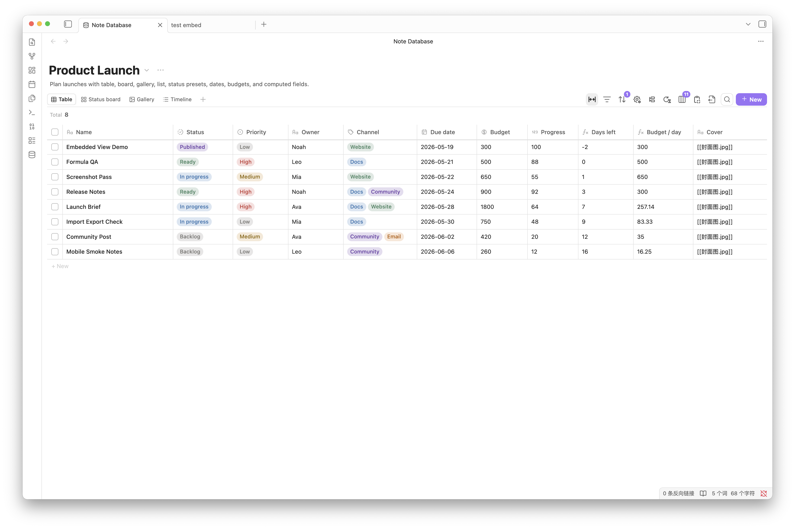

## Highlights

- **Four database views**: show the same notes as a table, board, gallery, or list. Each database can have up to 15 views, and every view can keep its own filters, sorting, grouping, visible properties, title field, and layout settings.
- **Inline property editing**: edit text, numbers, dates, currency, checkboxes, select, multi-select, status, and file names directly from the view. Changes are written back to Markdown frontmatter, and the file-name column can rename notes.
- **Complete property management**: add properties, rename labels, change keys, change types, hide or show fields, resize and reorder columns, manage option colors, configure status presets, and sync property types with Obsidian.
- **Stronger filters, sorting, and grouping**: combine AND/OR filter rules, use type-aware sorting, group tables, group board columns, add board subgroups, collapse groups, customize group order, and batch-select records.
- **Computed fields and formulas**: write formulas with field references, helper functions, syntax highlighting, live results, referenced-field values, and step-by-step calculation previews. Formula results can also be synced back to frontmatter.
- **Embed views in notes**: embed a database view in any Markdown note. Embedded views keep records read-only while still allowing view switching, filters, sorting, grouping, visible properties, formula sync, and copy/export actions.
- **Database files or settings databases**: keep databases in plugin settings, or generate `db_view: true` Markdown database files so the database configuration can live as a normal note.
- **Import, export, and migration**: import or export CSV + Markdown ZIP files, optionally include frontmatter in exported Markdown files, and convert Obsidian `.base` files into Note Database databases.
- **Local-first and localized**: the plugin runs inside Obsidian and does not upload vault content, metadata, formulas, or settings. The interface supports System, English, Simplified Chinese, and Traditional Chinese.

## Views

Table view is for structured data, field-heavy records, quick property editing, and column-header sorting.


Board view is for status-driven workflows such as tasks, process stages, reading progress, and review queues. It supports grouped columns, subgroups, card fields, batch selection, and custom group order.

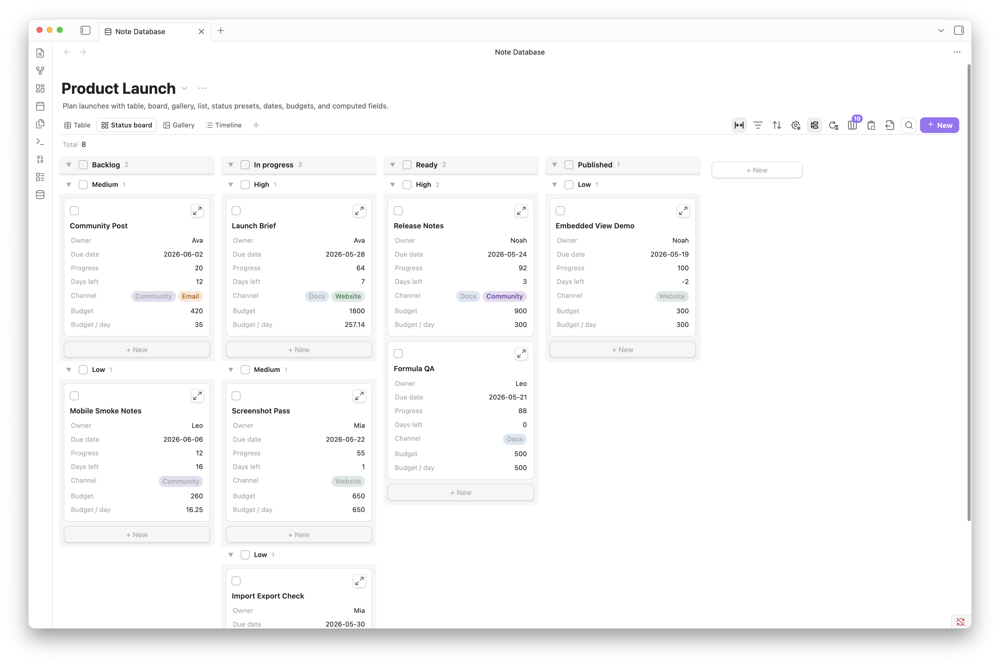

Gallery view is for reading plans, image references, portfolios, card-style content libraries, and visual browsing. You can configure cover fields, card width, image ratio, image fit, and visible properties.

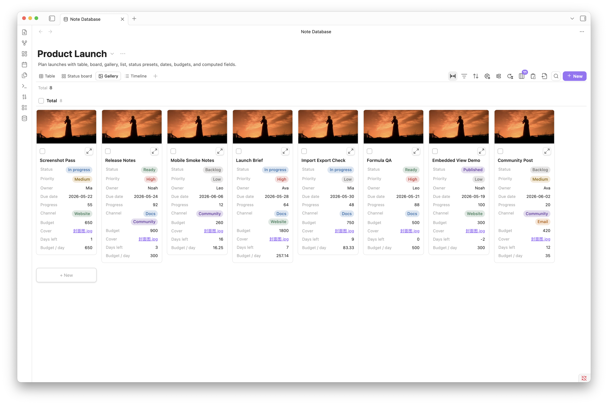

List view is for compact indexes, lightweight task lists, and directories. It keeps property display and grouping while using less space than gallery view.

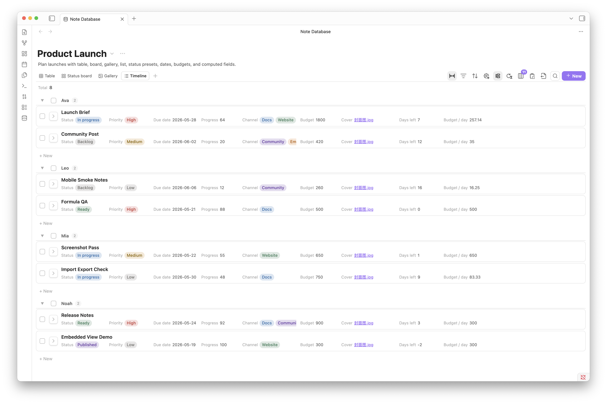

## Getting Started

Click the database icon in the left ribbon, or run `Note database: Open dashboard` from the command palette. The command palette can also import data, convert `.base` files, generate database files, or open existing database files.

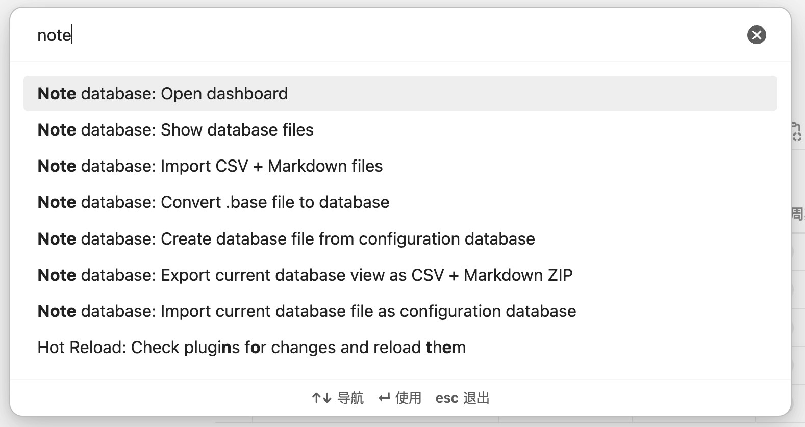

After creating a database, choose a source folder, then add properties and views. The source folder decides which Markdown notes belong to the database; view settings decide how those notes are presented.

The full dashboard settings panel separates "Current database" and "Current view": database settings cover the name, description, source folder, new-note folder, and formula sync; view settings cover the title field, default field width, gallery cover, board subgroup, status presets, and layout behavior.

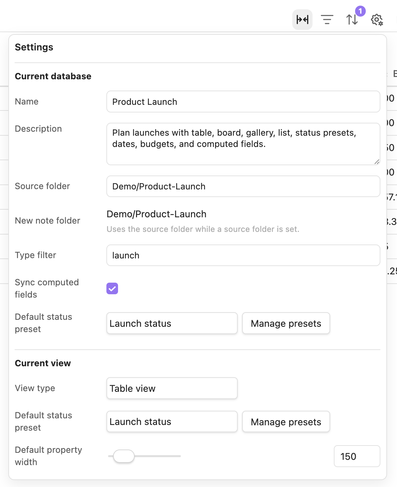

The plugin settings page manages global options such as language, the default database-file folder, global status presets, and settings-based databases.

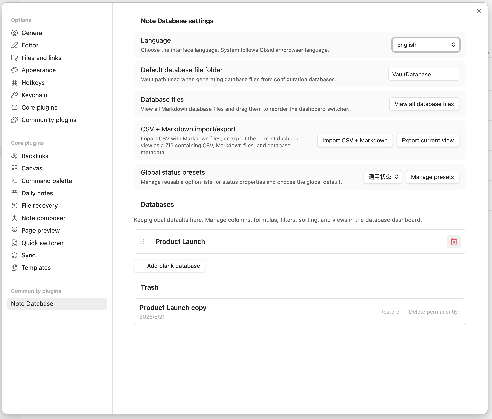

## Embedded Views

Right-click a view tab in the full dashboard, or use the export menu to copy the current view's embed code.

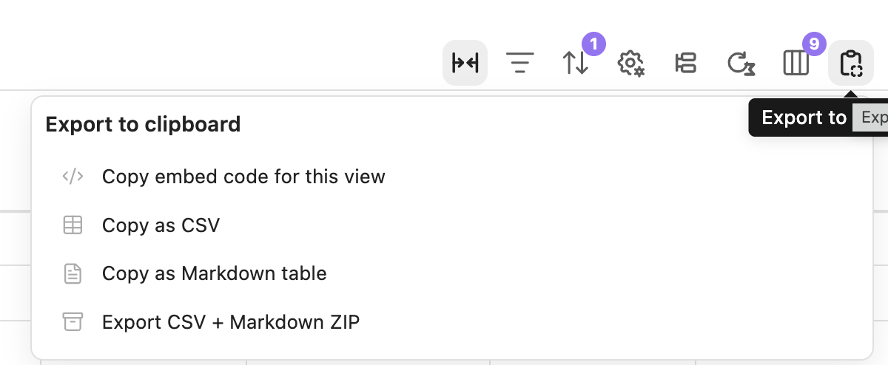

Paste the code into any Obsidian note to get a read-only embedded database view. Embedded views still include view switching, filters, sorting, grouping, visible properties, formula sync, and copy/export tools.

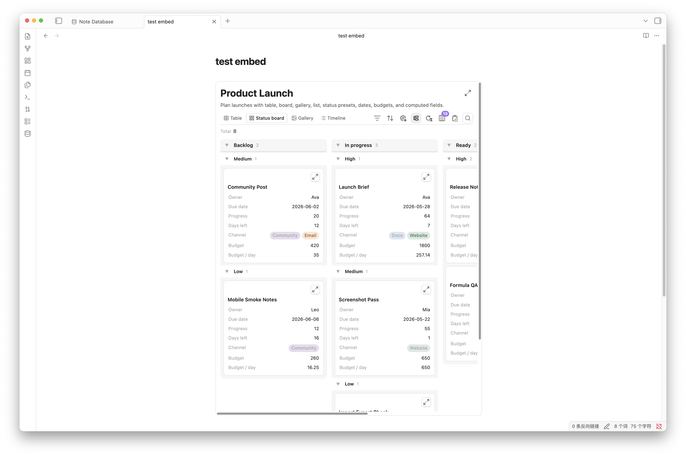

Embed code example:

~~~markdown
```note-database
dbPath: database/Example.md
viewId: mh2g9dz3_abcd123
```
~~~

If you want the database configuration itself to be saved as a Markdown file, use "Generate or open database file". The generated file uses `db_view: true` and stores its configuration in the frontmatter `database` object.

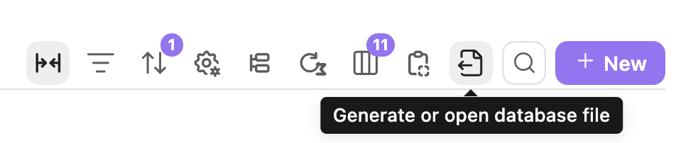

## Computed Fields And Formulas

Computed fields support bracket references such as `[Property name]`, as well as `field(name)` references. Formulas are evaluated as JavaScript expressions with a set of built-in helpers for note databases.

Common helpers:

| Function | Description |
| --- | --- |
| `today()` | Current date |
| `now()` | Current date and time |
| `days(dateA, dateB)` | Days between two dates |
| `daysFromNow(date)` | Days from today |
| `addMonths(date, n)` | Add n months to a date |
| `addYears(date, n)` | Add n years to a date |
| `round(n, d)` | Round a number |
| `floor(n)`, `ceil(n)` | Math rounding helpers |
| `max(a, b)`, `min(a, b)` | Compare values |
| `concat(a, b, ...)` | Join text |
| `if(condition, thenValue, elseValue)` | Conditional logic |

The formula editor shows available fields, function lists, examples, live preview results, referenced values, and step-by-step substitutions, so users do not have to write formulas in a blank textarea. It also includes a copyable AI prompt helper for sending the current formula draft, fields, and function context to an assistant.

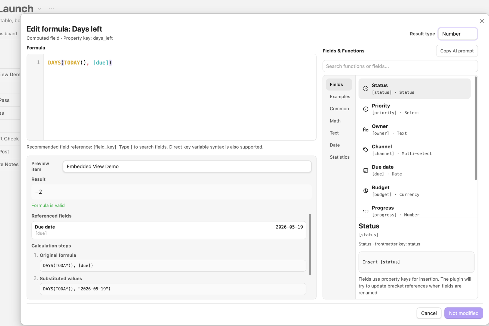

## Import And Export

Note Database can export the current database as a CSV + Markdown ZIP, and import the same format back. Export can optionally include frontmatter in the Markdown files, and the ZIP also includes database metadata to help restore properties, views, and configuration on re-import.

If imported CSV + Markdown files do not include database metadata, the plugin infers property types from CSV content and opens a confirmation dialog so you can review dates, numbers, checkboxes, select, multi-select, status fields, and other types before import.

The toolbar export menu can also copy the current view as embed code, CSV, or a Markdown table.


## `.base` File Conversion

If you already use Obsidian Bases, you can convert the current `.base` file into a Note Database database from the command palette. Conversion tries to preserve source rules, column order, column widths, sorting, grouping, and cards/list view information.

Before conversion finishes, the plugin opens a property confirmation dialog so you can review field types and adjust dates, numbers, checkboxes, select, multi-select, status fields, and other properties.

## Installation

### From Obsidian Community Plugins

1. Open Settings -> Community Plugins.
2. Search for `Note Database`.
3. Install and enable the plugin.

### Manual Installation

1. Download `main.js`, `styles.css`, and `manifest.json` from the latest release.
2. Create `.obsidian/plugins/note-database/` in your vault.
3. Copy the three files into that folder.
4. Enable the plugin in Settings -> Community Plugins.

## Development

```bash
npm install
npm run dev
npm run build
```

## Privacy

Note Database runs locally inside Obsidian. It does not send vault content, metadata, formulas, or settings to any external service. See [PRIVACY.md](PRIVACY.md).

## Support

If Note Database helps you, a star or donation helps support continued development:

<a href="https://paypal.me/pangy9">
  
</a>

## License

MIT
