# Note Database

[简体中文说明](README.zh-CN.md)

Local database views for Markdown notes in Obsidian.

Note Database turns Markdown files and frontmatter properties into editable table, board, gallery, list, chart, calendar, and timeline views. It stays local-first, works with plain Markdown files, and keeps database configuration inside your vault.

## Highlights

- **Seven database views**: switch the same notes between table, board, gallery, list, chart, calendar, and timeline layouts.
- **Markdown-first storage**: every database is saved as a normal `db_view: true` Markdown file in your vault.
- **Inline property editing**: edit text, numbers, dates, currency, checkboxes, selects, multi-selects, statuses, and file names directly from the view.
- **Spreadsheet-style table workflows**: navigate and select cells with the keyboard, fill or paste ranges, create overflow rows, rename files safely, and undo multi-cell operations as one transaction.
- **Typed bulk editing**: edit one property across many records with native field editors, impact previews, confirmation for risky changes, rollback, and single-step undo.
- **Database and record icons**: use Unicode Emoji or Lucide icons for databases and records, with database defaults and per-view record-icon fields.
- **Source-aware record creation**: create or insert notes while preserving writable source rules, visible group context, and manual order.
- **Inline markdown in text properties**: render bold, italic, highlight, strikethrough, inline code, links, wikilinks, and LaTeX inside any text column, with a floating format toolbar while editing.
- **Number display styles**: show number fields as a rating (stars or emoji), a progress bar, or a progress ring.
- **Flexible filtering and grouping**: combine filters, sorting, grouping, hidden fields, title fields, manual order, and per-view layout settings.
- **Unified source rules**: decide which notes belong to a database with folder, tag, property, and Bases-compatible rules, with a per-view enable/disable switch and built-in `aliases` support.
- **Chart view**: visualize the current filtered records with bar, line, area, donut, number, stacked, grouped, and mixed charts.
- **Calendar and timeline views**: schedule date and datetime properties with month, week, day, and long-range timeline scales.
- **Board subgroups and drag feedback**: organize board columns with secondary grouping and clearer drag targets.
- **Computed fields**: build formulas with field references, helper functions, live previews, and optional frontmatter sync.
- **Embedded views**: embed read-only database views inside any note while keeping view switching, filters, sorting, grouping, visible fields, and export tools available.
- **Database-file tab controls**: choose whether database files always open in new tabs and whether duplicate database-file tabs are prevented.
- **Import, export, and Bases conversion**: move data with CSV + Markdown ZIP files or convert Obsidian `.base` files.
- **Local and private**: vault content, metadata, formulas, and settings stay on your device.

## What's New In 1.2.6

- **Database covers**: add a local image cover to a database and drag it vertically to choose the visible crop.

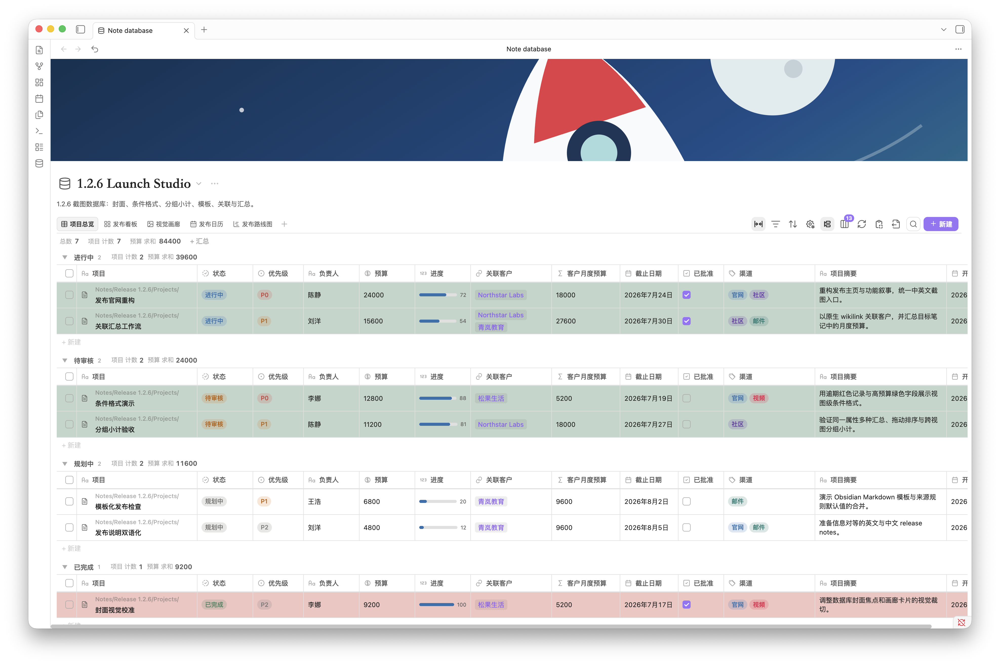

- **View-level conditional formatting**: color records or the matching property by rules based on numbers, dates, checkboxes, options, text, and empty values.

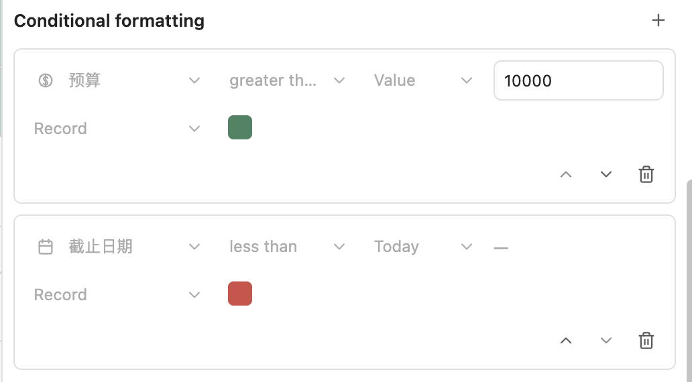

- **Group summaries**: show multiple reorderable count, sum, average, min/max, and other summaries in grouped table, board, gallery, list, and timeline views.


- **New-record templates**: apply an Obsidian Markdown template or Templater template when creating records, while preserving explicit view and source-rule defaults.

- **Local-first relations and rollups**: store relations as native Obsidian wikilinks and calculate read-only count, sum, average, or list rollups from linked notes within the selected database scope.

- **Board group creation**: create colored select, status, or multi-select groups directly from the end of a board, with option-colored group titles.

- **Faster, steadier editing**: incremental refreshes update affected rows when safe, inline editors respond sooner, and table/board focus and viewport positions are preserved more consistently.

## Views

| Table | Board |
| --- | --- |
|  |  |
| Dense property editing, column sorting, grouping, batch selection, resizing, and structured review. | Status-driven workflows with grouped columns, subgroups, card fields, manual ordering, and drag-and-drop updates. |

| Gallery | List |
| --- | --- |
|  |  |
| Visual browsing for reading plans, references, portfolios, and card-style content libraries. | Compact indexes for tasks, directories, research notes, and long lists that need fast scanning. |

| Chart | Timeline |
| --- | --- |
| 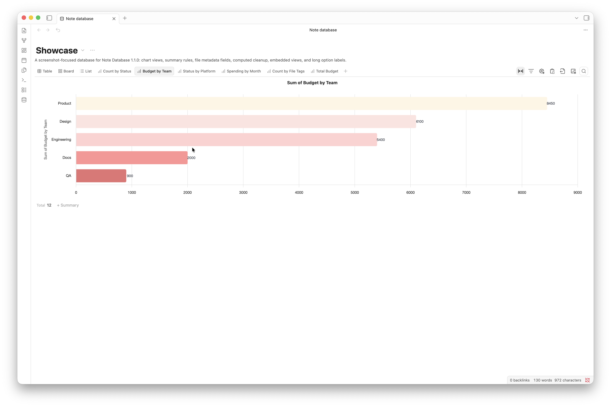 | 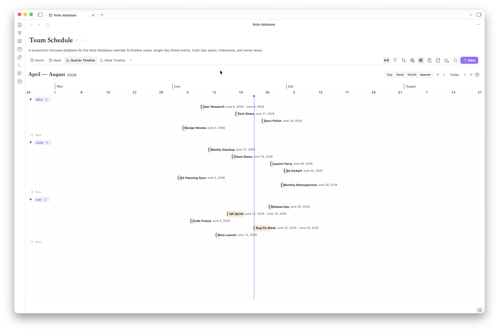 |
| Aggregate the current search and filter result into configurable charts with summaries, drilldown, palettes, and export. | Near-term review and compressed long-range planning with day, week, month, and quarter scales, grouping, drag, and resize. |

| Calendar (Month) | Calendar (Week) |
| --- | --- |
| 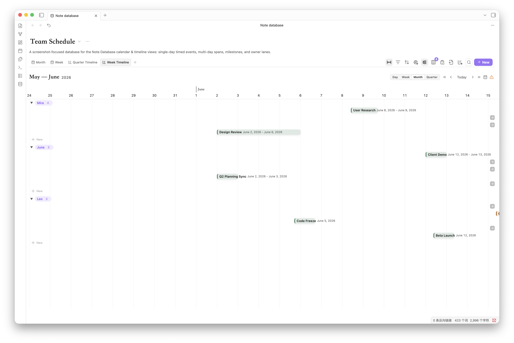 | 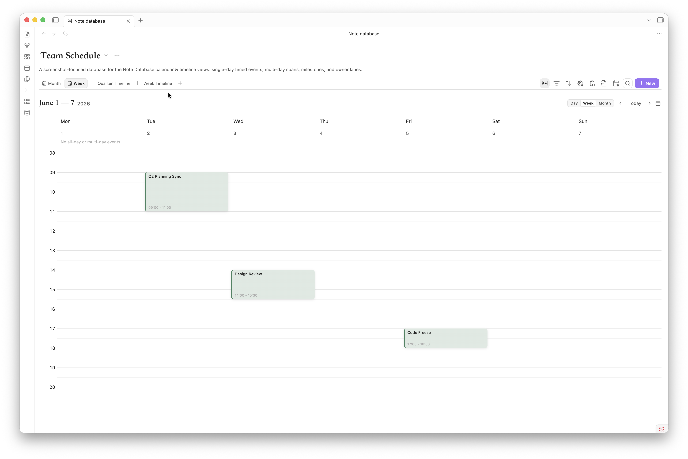 |
| Month-level scheduling for all-day spans, multi-day plans, and direct drag or resize date changes. | Near-term scheduling with an all-day lane and a time grid for date and datetime events. |

Each view can keep its own filters, sorting, grouping, visible fields, title field, and layout settings.

## Editing, Icons, And Record Creation

Table, board, gallery, and list views support typed bulk editing with the same editors used for individual properties. Before risky changes, Note Database previews the affected records, confirms the operation, and keeps rollback and undo within one transaction.

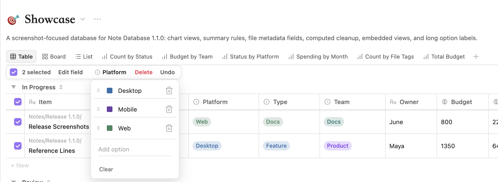

Databases and records can use Unicode Emoji or Lucide icons. A database can define the default record-icon property, while each view may override it when the same notes need a different visual role.

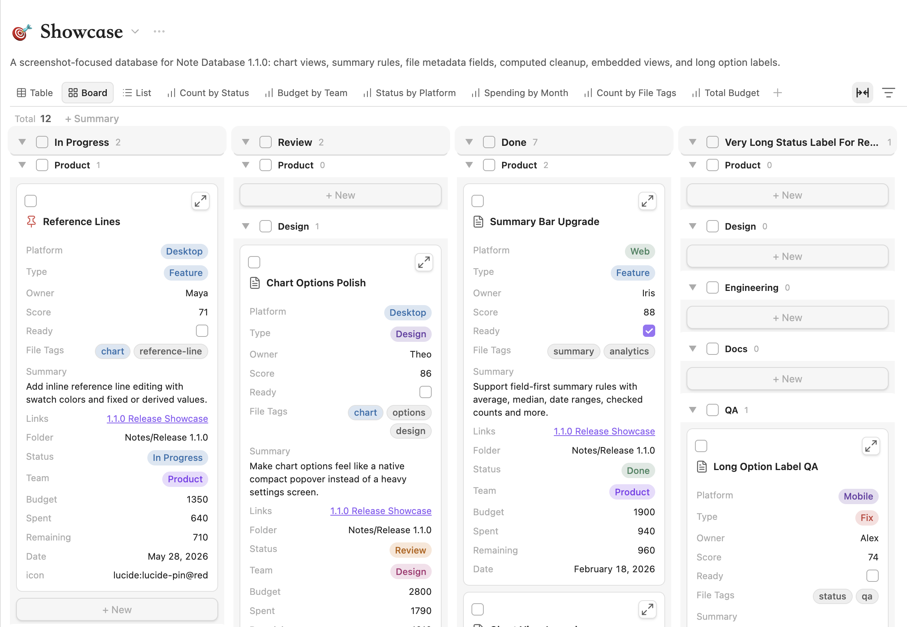

New notes are planned from the active source rules. Group buttons, row insertion, and other creation entry points preserve supported folder, tag, property, group, subgroup, and manual-order context, and warn instead of silently creating a note outside the database.

## Text Properties And Inline Markdown

Any text property can choose how it renders from its column menu:

- **Plain** — show the raw value as text (the default).
- **Link** — turn URLs and paths into clickable links.
- **Markdown** — render inline markdown.

Markdown mode supports bold, italic, strikethrough, highlight, inline code, standard links `[label](target)`, `[[wikilinks]]`, line breaks, and LaTeX math `$...$`. Parsing is recursive, so markup can nest (for example bold text containing an italic span). Unpaired markers like `5 * 3` or a stray `**` are left untouched, so ordinary text is never mangled.

While editing a markdown cell, a small floating toolbar lets you toggle bold, italic, strikethrough, highlight, code, and links without typing the markers by hand.

| 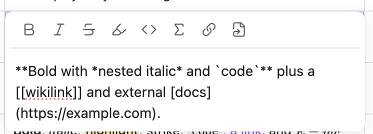 | 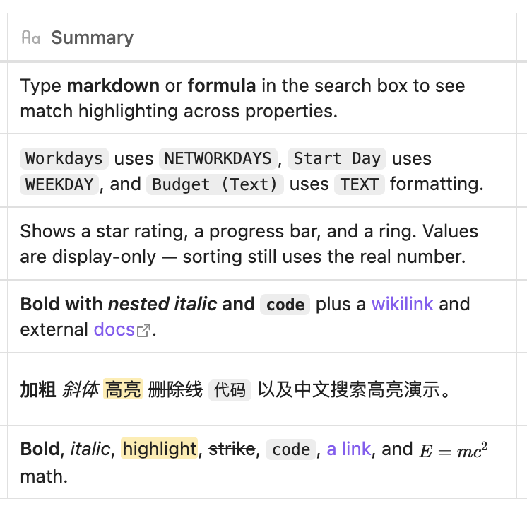 |
| --- | --- |

Rendering is built from text nodes only; the plugin never injects raw HTML, and dangerous link schemes (`javascript:`, `data:`, `file:`, etc.) are rejected. The original markdown source stays intact for sorting, search, and editing.

## Number Display Styles

Number fields can be presented in several ways without changing the stored value:

- **Rating** — stars or a custom emoji scale, useful for priority, difficulty, or reviews.
- **Progress bar** — a horizontal fill, where you choose the value that equals 100%.
- **Progress ring** — a circular fill for compact dashboards.

These styles are display-only: the underlying number in frontmatter is never rewritten, so sorting, formulas, and export keep working on the real value.

| 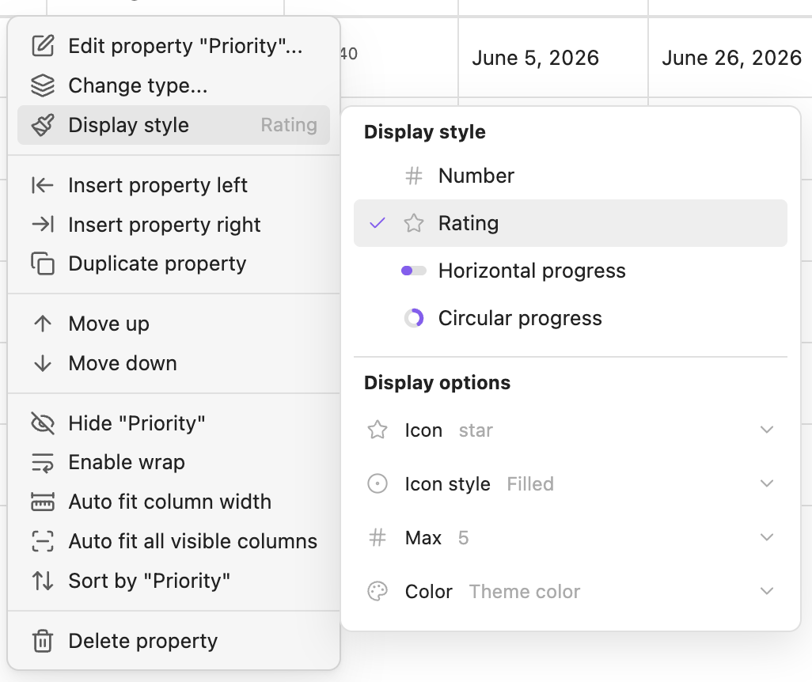 |  |
| --- | --- |

## Chart Views

Chart views use the same records as the current database after search, filters, and result limits. They support count and numeric aggregations, date and number buckets, visible group controls, cumulative series, reference lines, data labels, legends, and PNG export.

Click a chart mark to inspect the matching records before applying it as a filter.

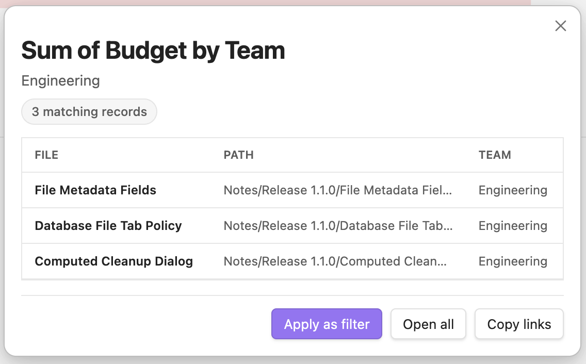

Summary rules can combine count-style, numeric, date, checkbox, and unique-value calculations.


## Calendar And Timeline Views

Calendar views turn date and datetime fields into month, week, and day schedules. Multi-day events stay readable across cells, all-day spans can be moved or resized, and week/day time grids support timed event creation and editing. Datetime fields can also be grouped by date only, so events at different times on the same day land in the same group.

Timeline views focus on planning across short and long ranges. Use day scale for datetime detail, week scale for near-term review, month scale for multi-day overview, and quarter scale for compressed long-range planning. Events can be grouped, dragged, resized, and inspected with compact range labels.

## Getting Started

Click the database icon in the left ribbon, or run `Note database: Open dashboard` from the command palette. The command palette can also import data, convert `.base` files, or open the corresponding database file.


After creating a database, choose a source folder, then add properties and views. The source folder decides which Markdown notes belong to the database; view settings decide how those notes are presented.

The dashboard settings panel separates "Current database" and "Current view": database settings cover the name, description, source folder, and new-note folder; view settings cover the title field, default field width, gallery cover, board subgroup, status presets, and layout behavior.


The plugin settings page manages global options such as language, the default database-file folder, global status presets, database files, import/export, and the plugin trash.


Database-file opening can also be tuned from plugin settings. You can always open database files in a new tab, prevent duplicate tabs for the same database file, or combine both settings depending on how you use Obsidian panes. The same behavior is applied when opening from the dashboard, the file explorer, and database-file drag/open fallbacks.

## Embedded Views

Right-click a view tab in the full dashboard, or use the export menu to copy the current view's embed code.


Paste the code into any Obsidian note to get a read-only embedded database view. Embedded views still include view switching, filters, sorting, grouping, visible properties, computed fields, and copy/export tools.


Use the floating header toggle in an embedded block, or add `hideHeader: true`, when you want the block to omit the database header and use the whole area for view content.

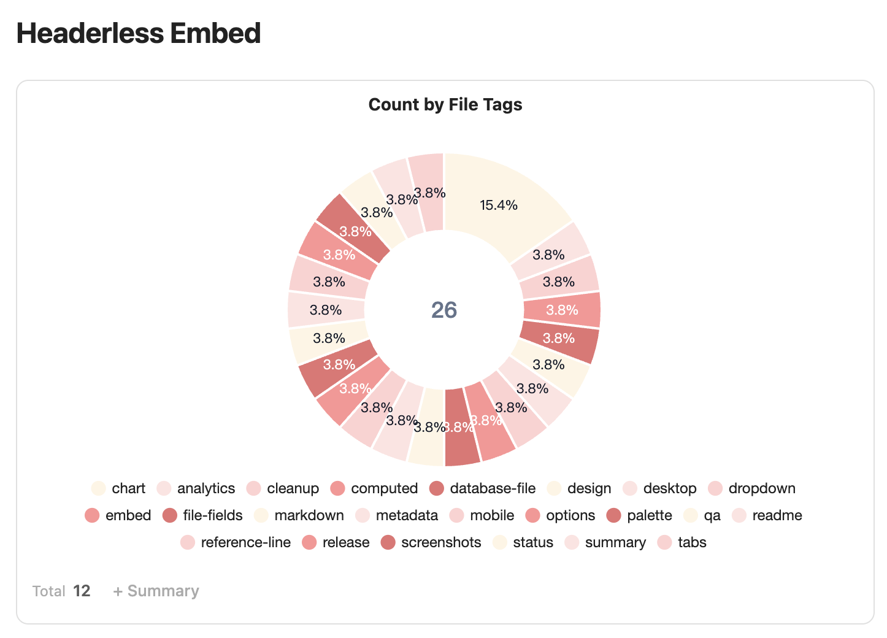

Embed code example:

~~~markdown
```note-database
dbPath: database/Example.md
viewId: mh2g9dz3_abcd123
```
~~~

Every database configuration is saved as a Markdown file with `db_view: true`, with its configuration stored in the frontmatter `database` object. Existing settings-based databases from earlier versions are migrated automatically.


## Computed Fields And Formulas

Computed fields support bracket references such as `[Property name]`. Direct variable names and `field("field_key")` are also supported for compatibility, but bracket references are the recommended format. Formulas use safe expression evaluation with built-in helpers for note databases.

Common helpers:

| Function | Description |
| --- | --- |
| `TODAY()` | Current date |
| `NOW()` | Current date and time |
| `DAYS(start_date, end_date)` | Days between two dates |
| `DAYSFROMNOW(date)` | Days from today |
| `ADDDAYS(date, days)` | Add days to a date |
| `DATEADD(date, amount, "days")` | Add days, weeks, months, or years to a date |
| `NETWORKDAYS(start, end, [holidays])` | Working days between two dates, skipping weekends and optional holidays |
| `WEEKDAY(date, [return_type])` | Day of week; default 0=Sun..6=Sat, optional Excel return type |
| `ROUND(number, digits)` | Round a number |
| `FLOOR(number)`, `CEILING(number)` | Math rounding helpers |
| `MAX(a, b, ...)`, `MIN(a, b, ...)` | Compare values |
| `TEXT(value, format)` | Format a number (e.g. `#,##0.00`, `0%`) or date |
| `CONCAT(text1, text2, ...)` | Join text |
| `IF(condition, trueValue, falseValue)` | Conditional logic |

The formula editor shows available fields (each with its type icon), function lists, examples, live preview results, referenced values, and step-by-step substitutions, so users do not have to write formulas in a blank textarea. It also includes a copyable AI prompt helper for sending the current formula draft, fields, and function context to an assistant.

Computed values refresh for display whenever a database view is opened. In the database settings, choose whether those values remain display-only virtual properties, are written back to frontmatter automatically, or are written back only when you click the manual sync button.


If you previously saved a computed result into note frontmatter and later decide to keep it display-only, use the cleanup action to remove that saved property from notes in the current database scope.

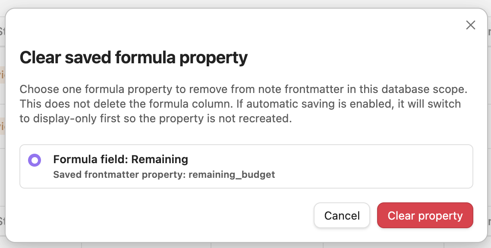

## Search And Source Rules

**Search** matches text across every visible property value plus the file name, and highlights the matched text inside the results. Search is a transient in-session filter — it is never written to your database or note files, so switching panes never leaves a stale query behind. Date properties match their visible localized text or explicit date shapes (`YYYY-MM-DD`, `YYYY-MM`, `MM-DD`).

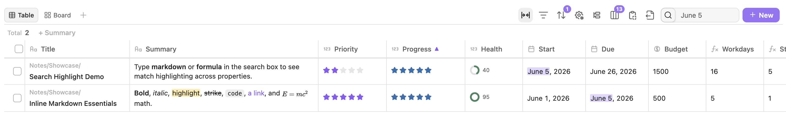

**Source rules** decide which notes belong to a database. Combine folder, tag, property, link, and expression rules with `AND` / `OR` / `NOT` logic. Each view can enable or disable its own source rules on top of the database-level rules, so one database can power several scoped views. The custom-property picker is searchable and shows each property's type icon, and built-in list properties like Obsidian `aliases` are treated as multi-value fields.

If you already use Obsidian Bases, source rules, `aliases`, and `.base` conversion stay aligned with how regular filters, grouping, and sorting treat multi-value fields.

## File Metadata Fields

Built-in file fields such as `file.name`, `file.tags`, `file.links`, `file.folder`, and file timestamps are treated as file metadata instead of ordinary frontmatter properties. `file.name` can rename the note, `file.tags` can update frontmatter tags, and read-only metadata fields are protected from accidental writes.

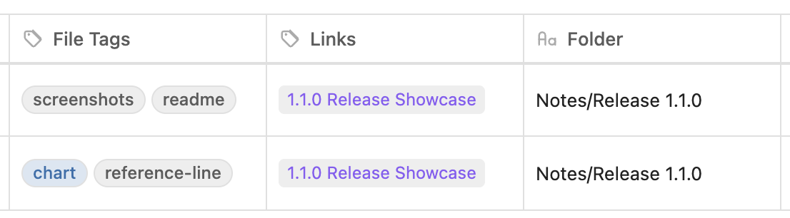

## Import, Export, And Bases

Note Database can export the current database as a CSV + Markdown ZIP, and import the same format back. Export lets you choose the ZIP location, can optionally include frontmatter in the Markdown files, and the ZIP also includes database metadata to help restore properties, views, and configuration on re-import.

If imported CSV + Markdown files do not include database metadata, the plugin infers property types from CSV content and opens a confirmation dialog so you can review dates, numbers, checkboxes, select, multi-select, status fields, and other types before import.

The toolbar export menu can also copy the current view as embed code, CSV, or a Markdown table.


If you already use Obsidian Bases, you can convert the current `.base` file into a Note Database database from the command palette. Conversion tries to preserve source rules, column order, column widths, sorting, grouping, and cards/list view information.

Source filters are converted without flattening nested `AND`, `OR`, or `NOT` groups. Simple rules are editable as fields and operators; richer Bases filter statements are preserved as editable expression rules and evaluated with the built-in compatibility layer. Unsupported plugin-specific expressions are not silently simplified.

Before conversion finishes, the plugin opens a property confirmation dialog so you can review field types and adjust dates, numbers, checkboxes, select, multi-select, status fields, and other properties.

## Installation

### From Obsidian Community Plugins

1. Open Settings -> Community Plugins.
2. Search for `Note Database`.
3. Install and enable the plugin.

### Manual Installation

1. Download `main.js`, `styles.css`, and `manifest.json` from the latest release.
2. Create `.obsidian/plugins/note-database/` in your vault.
3. Copy the three files into that folder.
4. Enable the plugin in Settings -> Community Plugins.

## Privacy

Note Database runs locally inside Obsidian. It does not send vault content, metadata, formulas, or settings to any external service. See [PRIVACY.md](PRIVACY.md).

## Support

If Note Database helps you, a star or donation helps support continued development:

<a href="https://paypal.me/pangy9">
  
</a>


## Changelog

### 1.2.6

- Added database covers with adjustable image positioning, view-level conditional formatting, cross-view group summaries, new-record templates, and local-first relation/rollup fields backed by Obsidian wikilinks.
- Added direct colored group creation for select, status, and multi-select board groups.
- Expanded spreadsheet-style table keyboard navigation, range selection, fill, paste, overflow row creation, transactional file renaming, and focus restoration.
- Added incremental record refresh and local DOM updates for smoother inline editing, with safer editor, selection, and viewport preservation.
- Improved record icons, checkbox grouping, calendar/timeline overflow panels, all-day icons, new-entry overlay guards, column insertion, multi-select refresh, and board summary truncation.

### 1.2.5

- Added source-rule-aware record creation: new notes now derive writable file names, folders, tags, properties, and supported boundaries from active database and view source rules, with clear warnings when a rule cannot be guaranteed.
- Added typed bulk editing across table, board, gallery, and list views. Native editors, impact previews, risk confirmation, option registration, rollback, and single-step undo are shared across bulk workflows.
- New select, status, and multi-select values explicitly entered or adopted through plugin UI are now registered automatically, while values written externally remain non-destructive to the database schema.
- Added configurable database and record icons using Unicode Emoji or Lucide icons. Record icons can inherit a database field or use a per-view override across board, gallery, list, calendar, and timeline cards.
- Added row-menu actions to insert a record above or below the current visible row, preserving group/subgroup context and manual order where available.

- Open dashboards now react immediately to database settings changes and restore the active database by identity after settings reorder or deletion.
- Improved automatic column width measurement for rendered Markdown, links, bold text, inline code, and MathJax formulas, plus gallery grouped-width and newly-added-column reveal behavior.
- Improved `file.*` field handling, title editing, Cmd/Ctrl+F search focus, mobile database-list layout, and several grouped insertion and popover interaction edge cases.

### 1.2.4

- Fixed table selection-column checkbox alignment.

### 1.2.3

- Added global property-type conflict detection for database files, with an in-place resolution dialog for incompatible frontmatter storage shapes.
- Added floating record detail panels for calendar and timeline events, including editable fields, file-name renaming, markdown/link text rendering, and image thumbnails.
- Improved calendar and timeline search with a focused result panel that shows total matches, current-range matches, grouped results, jump navigation, and jump highlight feedback.
- Refined calendar and timeline event layout, drag, resize, mini-calendar markers, invalid-event filtering, and month-row density so cross-day events behave more consistently.
- Added table keyboard navigation, option-popover focus handling, record copy/clone actions, and more robust CSV/Markdown clipboard paste handling.
- Standardized title-field behavior across board, gallery, list, calendar, and timeline views: configured-but-empty title fields now show an explicit empty title instead of silently falling back to the file name.
- Added file-property creation shortcuts in the column manager, an option to clean only note frontmatter when deleting columns, date/time picker mini calendars, and compact field wrapping for list cards.

### 1.2.2

- Added inline markdown rendering for text properties (bold, italic, highlight, strikethrough, code, links, wikilinks, LaTeX) with a plain / link / markdown render-mode switch per column and a floating format toolbar.
- Added number display styles: rating (stars or emoji), progress bar, and progress ring — display-only, never rewriting the stored value.
- Extended formulas with `NETWORKDAYS`, `WEEKDAY` (with optional return type), and `TEXT`, and added type icons to the formula editor property suggestions.
- Smarter search: matches every property value plus file name, highlights matched text in results, and keeps search transient across pane switches.
- Unified source rules: legacy type filters migrated to source rules, per-view enable/disable switch, searchable type-icon property picker, and full `aliases` / Bases multi-value alignment.
- Added checkbox range (shift-click) selection across the table and option modals, IME-safe Enter/Esc in text editors, and group record-count limits.
- Improved mobile layout, including a dedicated column-width panel and refined card field widths.

### 1.2.1

- Added a mobile table column-width adjustment panel and refined mobile settings and column selection.
- Added group record-count limits and board card field width controls (board/gallery width cap, list effective width).
- Added number rating / progress bar / progress ring display styles and a fixed board long-group header that no longer pins column width.
- Improved datetime editing (segmented time input) and datetime "ignore time" grouping.
- Refined embedded-view reference handling and read-only invalid-event warnings.

### 1.2.0

- Added calendar and timeline views for date and datetime properties, including month/week/day calendar scales and day/week/month/quarter timeline scales.
- Added richer date and datetime handling: localized display, datetime formulas, cross-day labels, consistent invalid-range handling, and repair prompts.
- Improved calendar and timeline interaction details, including drag/resize behavior, current-range highlighting, mini-calendar navigation, clipped event fades, and responsive timeline windows.
- Fixed day-based calendar and timeline drags so datetime events keep their original clock times.
- Improved drag/drop feedback for board cards, groups, rows, and timeline events.
- Improved embedded views so refreshing database blocks does not pull the surrounding Markdown note back to the embed.

### 1.1.0

- Added chart views with bar, horizontal bar, line, area, donut, number, stacked, grouped, percent-stacked, and mixed chart layouts.
- Added chart options, chart summaries, visible groups, palettes, reference lines, drilldown records, and PNG export/copy.
- Expanded summary rules with numeric, date, checkbox, unique, empty, and filled calculations.
- Added protected file metadata fields, including editable `file.name` and `file.tags`, clickable file links, and read-only file metadata guards.
- Added computed frontmatter cleanup for users who want to remove previously saved computed values from note frontmatter.
- Added database-file tab controls for always opening database files in new tabs and preventing duplicate database-file tabs.
- Improved embedded views, shared dropdowns, source rules, drag feedback, option editing, and release-readiness UI polish.


See the [GitHub releases](https://github.com/pangy9/obsidian-note-database/releases) for full release history.
