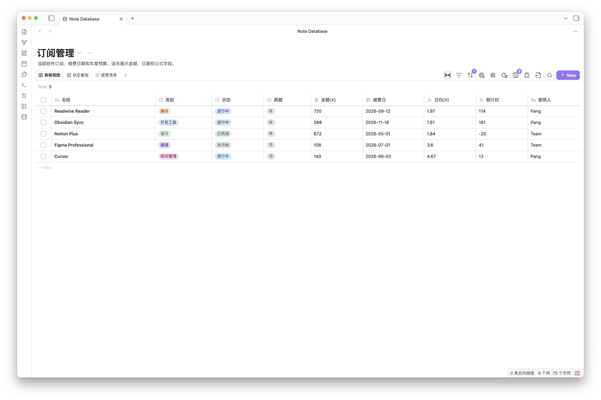
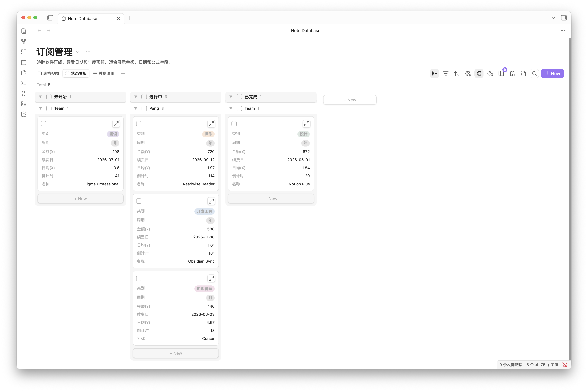
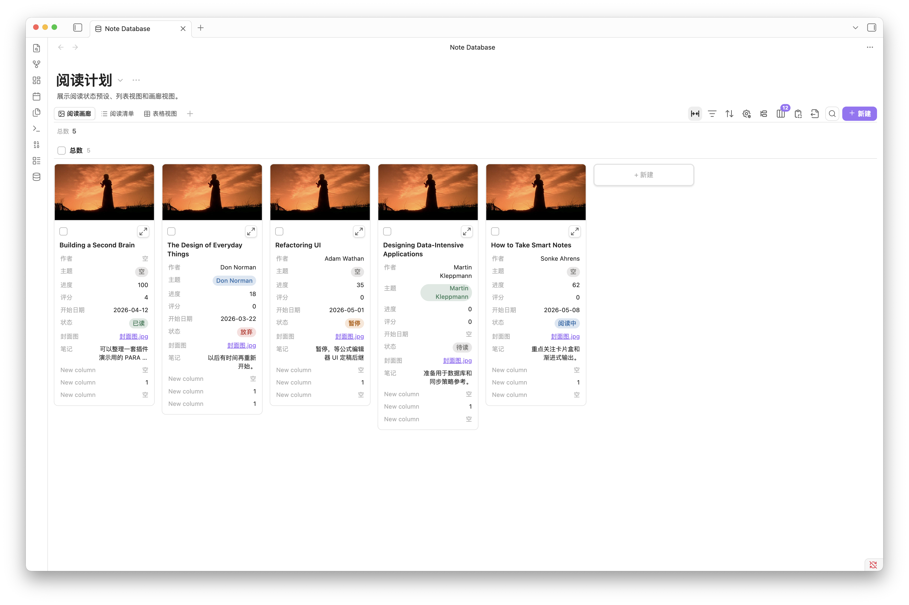
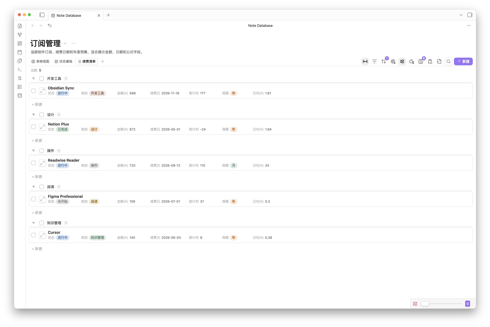
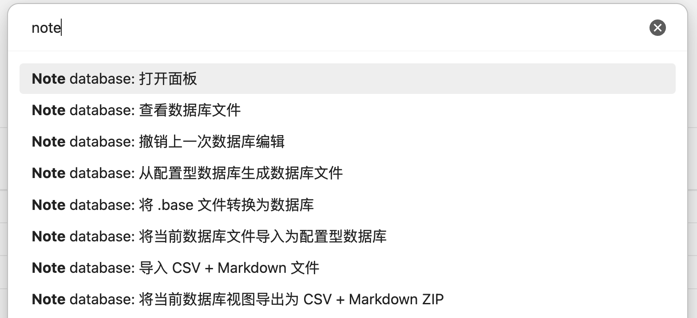
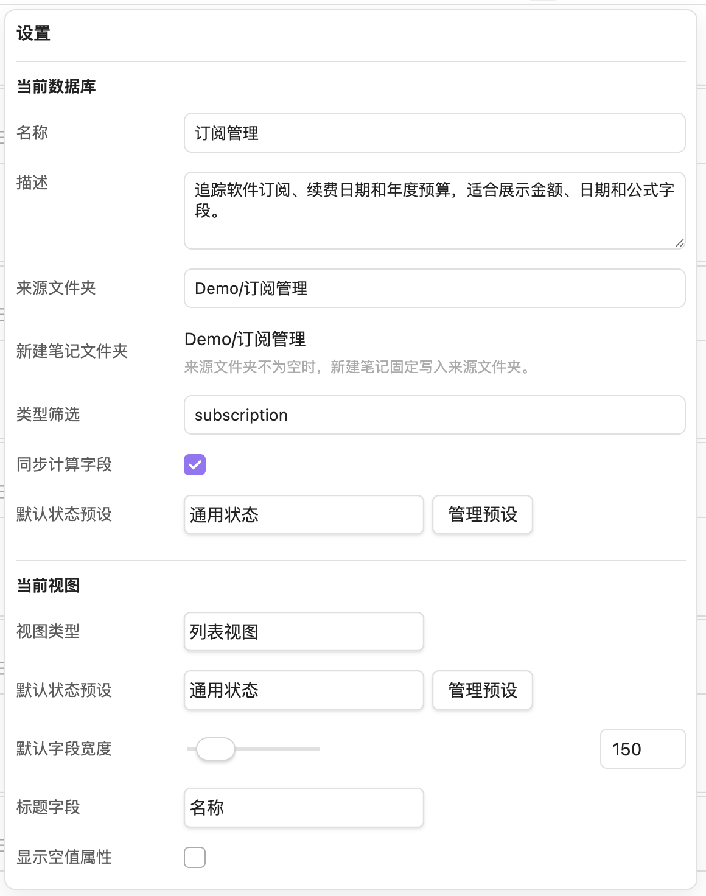
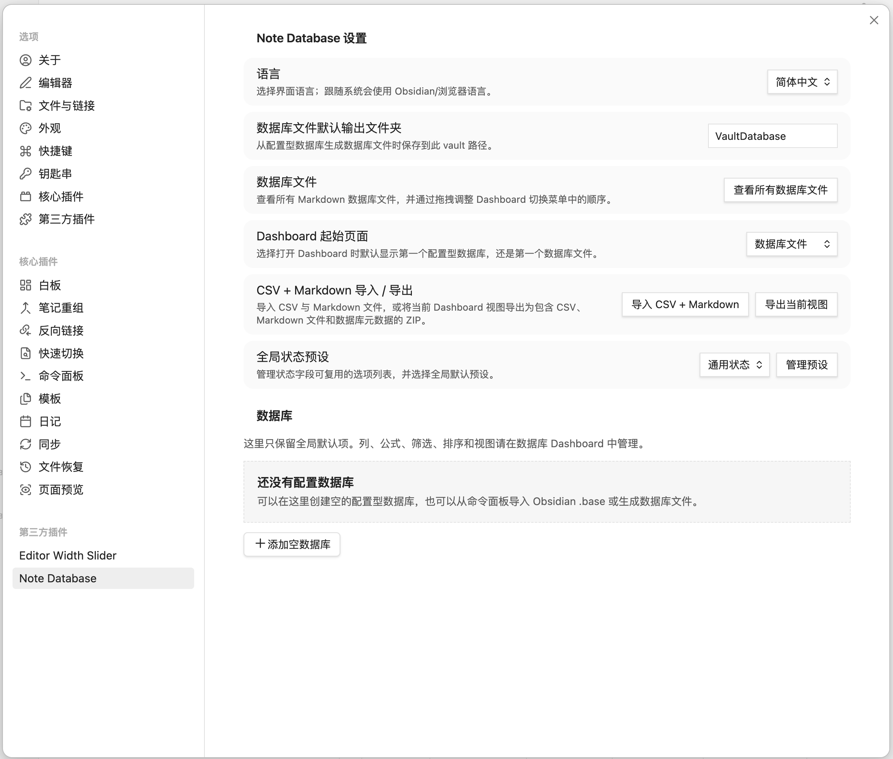
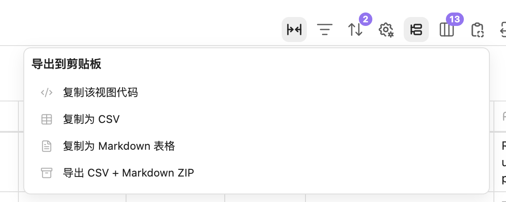
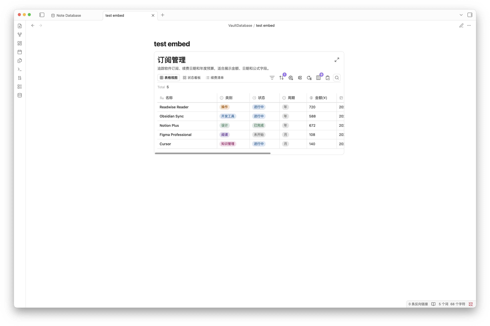
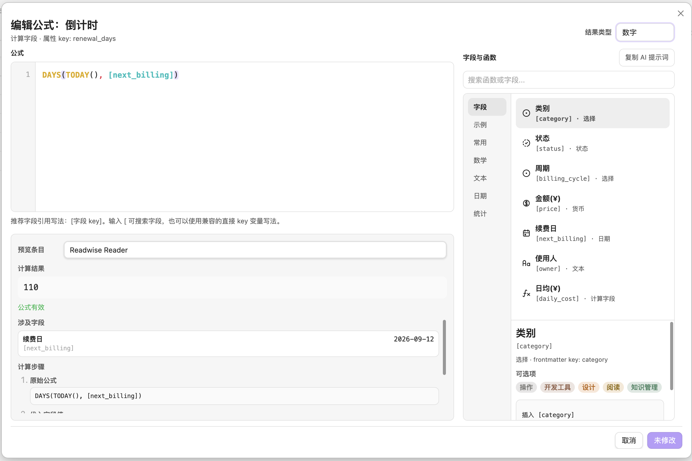

# Note Database

[English README](README.md)

Note Database 是一个面向 Obsidian 笔记的本地数据库视图插件。它把 Markdown 文件和 frontmatter 组织成可编辑、可筛选、可分组、可嵌入的数据库，让一组笔记既能保持 Markdown 的开放格式，又能拥有接近工作台的结构化管理体验。

适合用来管理项目、阅读计划、订阅清单、内容库、任务流、资料索引、课程/研究笔记，以及任何需要把笔记按属性组织起来的场景。



## 1.0.3 更新亮点（相较于 1.0.1）

- **更稳定的写入与刷新**：同一文件的 frontmatter 写入串行化，减少并发覆盖；计算字段同步与内嵌刷新也更可靠。
- **数据库文件体验更一致**：`db_view: true` 数据库文件打开后会自动切到专用数据库视图，不再需要把它当普通 Markdown 预览来用。
- **内嵌视图增强**：内嵌表格支持批量选择单元格并复制到剪贴板；导出 CSV + Markdown ZIP 也可在内嵌视图里直接使用。
- **批量编辑与撤销**：表格支持拖拽选择矩形区域，复制 TSV/Markdown/CSV；批量填充、清空、粘贴等操作支持撤销与跳过不可编辑字段提示。
- **公式编辑器更顺滑**：窄窗口/矮屏下不再互相挤压重叠；字段/函数帮助区支持横向滚动；预览区支持滚动并避免信息串行覆盖。
- **新增 Dashboard 起始页面设置**：可选择打开 Dashboard 时默认进入配置型数据库或数据库文件（不存在则自动回退到可用数据库）。

## 核心亮点

- **四种数据库视图**：同一组笔记可以切换为表格、看板、画廊和列表。每个数据库最多支持 15 个视图，每个视图都可以保存自己的筛选、排序、分组、显示属性、标题字段和布局设置。
- **直接编辑笔记属性**：支持文本、数字、日期、货币、复选框、单选、多选、状态和文件名内联编辑。修改会写回 Markdown frontmatter，文件名列也可以直接触发重命名。
- **完整的属性管理**：支持新增、重命名、修改 key、修改类型、隐藏/显示、列宽调整、列顺序拖拽、选项颜色和状态预设管理，并会同步 Obsidian 属性类型。
- **更强的筛选、排序、分组**：支持 AND/OR 多条件筛选、类型感知排序、表格分组、看板分组、看板子组、分组折叠、自定义分组顺序和批量选择。
- **计算字段 / 公式**：公式编辑器支持字段引用、常用函数、语法高亮、实时结果、引用字段值和逐步计算预览，也可以把计算结果同步回 frontmatter。
- **嵌入任意笔记**：可以把数据库视图嵌入到普通 Markdown 笔记中。嵌入视图保持记录只读，但可以同步筛选、排序、分组、属性显示等视图配置。
- **数据库文件与配置型数据库并存**：既可以把数据库保存在插件设置中，也可以生成 `db_view: true` 的 Markdown 数据库文件，方便把数据库配置作为普通笔记管理。
- **导入导出与迁移**：支持 CSV + Markdown ZIP 导入导出，可选择是否在导出的 Markdown 文件中包含 frontmatter 字段，也支持从 Obsidian `.base` 文件转换为 Note Database 数据库。
- **本地优先与多语言**：插件在 Obsidian 内本地运行，不上传 vault 内容、metadata、公式或设置。界面支持跟随系统、English、简体中文和繁體中文。

## 多视图展示

表格视图适合处理结构化数据、批量查看字段、快速编辑属性和使用列头排序。


看板视图适合任务状态、流程阶段、阅读进度等按状态推进的场景。看板支持分组列、子组、卡片字段显示、批量选择和分组顺序调整。



画廊视图适合阅读计划、图片资料、作品集、卡片式内容库等视觉浏览场景。可以设置封面字段、卡片宽度、图片比例和显示属性。



列表视图适合需要更紧凑浏览的资料目录、待办清单和轻量索引。它保留属性展示和分组能力，同时比画廊更节省空间。



## 快速开始

点击左侧 ribbon 的数据库图标，或在命令面板中运行 `Note database: 打开面板`。你也可以通过命令面板导入数据、转换 `.base` 文件、生成数据库文件或打开已有数据库文件。



创建数据库后，选择来源文件夹，再添加属性和视图。来源文件夹决定哪些 Markdown 笔记会被纳入数据库；视图设置决定这组笔记以什么方式呈现。

完整数据库界面的设置面板会区分“当前数据库”和“当前视图”：数据库设置负责名称、描述、来源文件夹、新建目录和公式同步；视图设置负责标题字段、默认字段宽度、画廊封面、看板子组、状态预设等布局行为。



插件设置页用于配置全局选项，例如语言、默认数据库文件夹、全局状态预设，以及配置型数据库的管理。



## 嵌入视图

在完整数据库中右键视图标签，或从导出菜单复制当前视图的嵌入代码。



把代码粘贴到任意 Obsidian 笔记中，就可以得到一个只读的嵌入数据库视图。嵌入视图仍然保留视图切换、筛选、排序、分组、属性显示、同步公式和复制导出等工具栏能力。



嵌入代码示例：

~~~markdown
```note-database
dbPath: database/Example.md
viewId: mh2g9dz3_abcd123
```
~~~

如果你希望数据库配置本身也以 Markdown 文件保存，可以使用“生成或打开数据库文件”。生成后的数据库文件会带有 `db_view: true`，并把配置存储在 frontmatter 的 `database` 对象中。


## 计算字段 / 公式

计算字段支持 `[字段名]` 这样的方括号引用，也支持 `field(name)` 引用字段。公式基于 JavaScript 表达式求值，并提供一组适合笔记数据库的内置函数。

常用函数示例：

| 函数 | 说明 |
| --- | --- |
| `today()` | 当前日期 |
| `now()` | 当前日期和时间 |
| `days(dateA, dateB)` | 计算两个日期之间的天数 |
| `daysFromNow(date)` | 计算某日期距离今天的天数 |
| `addMonths(date, n)` | 给日期增加 n 个月 |
| `addYears(date, n)` | 给日期增加 n 年 |
| `round(n, d)` | 四舍五入 |
| `floor(n)`, `ceil(n)` | 数学取整函数 |
| `max(a, b)`, `min(a, b)` | 比较大小 |
| `concat(a, b, ...)` | 拼接文本 |
| `if(condition, thenValue, elseValue)` | 条件判断 |

公式编辑器会显示可用字段、函数列表、示例、实时预览、引用字段值和逐步替换过程，避免用户在一个大文本框里盲写公式。右上角还提供复制 AI 提示词的入口，方便把当前字段、函数和公式草稿发给任意 AI 辅助修改。



## 导入导出

Note Database 支持把当前数据库导出为 CSV + Markdown ZIP，也支持再导入这种格式。导出时可以选择是否把 frontmatter 字段写入 Markdown 文件，ZIP 内还会包含数据库元数据，方便在重新导入时尽量恢复属性、视图和配置结构。

如果导入的 CSV + Markdown 文件没有包含数据库元数据，插件会根据 CSV 内容推断字段类型，并在导入前弹出确认界面，让你检查日期、数字、复选框、单选、多选、状态等字段类型。

工具栏的导出菜单还可以把当前视图复制为嵌入代码、CSV 或 Markdown 表格。


## `.base` 文件转换

如果你已经使用了 Obsidian Bases，可以通过命令面板把当前 `.base` 文件转换为 Note Database 数据库。转换会尽量保留来源规则、列顺序、列宽、排序、分组，以及 cards/list 视图信息。

转换后会弹出属性确认界面，你可以在导入前检查字段类型，把日期、数字、复选框、单选、多选、状态等字段调整到合适类型。

## 安装

### 从 Obsidian 社区插件市场安装

1. 打开 Settings -> Community Plugins。
2. 搜索 `Note Database`。
3. 安装并启用插件。

### 手动安装

1. 从最新 release 下载 `main.js`、`styles.css` 和 `manifest.json`。
2. 在 vault 中创建 `.obsidian/plugins/note-database/` 文件夹。
3. 把三个文件复制进去。
4. 在 Settings -> Community Plugins 中启用插件。

## 开发

```bash
npm install
npm run dev
npm run build
```

## 隐私

Note Database 完全在 Obsidian 本地运行。它不会把 vault 内容、metadata、公式或设置发送到任何外部服务。详情见 [PRIVACY.md](PRIVACY.md)。

## 支持与打赏

如果 Note Database 帮到了你，欢迎 star 或通过下面的链接支持后续开发：

<a href="https://paypal.me/pangy9">
  
</a>


## 许可证

MIT
