# Note Database

[English README](README.md)

为 Obsidian Markdown 笔记提供本地数据库视图。

Note Database 可以把 Markdown 文件和 frontmatter 属性组织成可编辑的表格、看板、画廊、列表、图表、日历和时间线视图。它保持本地优先，直接使用普通 Markdown 文件，并把数据库配置保存在你的 vault 中。

## 核心亮点

- **七种数据库视图**：同一组笔记可以在表格、看板、画廊、列表、图表、日历和时间线之间切换。
- **Markdown 优先存储**：每个数据库都保存为 vault 中普通的 `db_view: true` Markdown 文件。
- **直接编辑属性**：可以在视图中编辑文本、数字、日期、货币、复选框、单选、多选、状态和文件名。
- **文本属性支持 inline Markdown**：任意文本列都可渲染加粗、斜体、高亮、删除线、行内代码、链接、`[[双链]]` 和 LaTeX，编辑时还有浮动格式工具栏。
- **数字显示样式**：数字字段可显示为评分（星标或 emoji）、进度条或圆环，并支持货币、千分位和小数格式。
- **灵活筛选与分组**：支持筛选、排序、分组、隐藏字段、标题字段、手动排序和每个视图独立的布局设置。
- **统一的来源规则**：用文件夹、标签、属性、链接和兼容 Bases 的规则决定哪些笔记属于数据库，支持按视图启用/禁用，内置 `aliases` 支持。
- **图表视图**：把当前筛选后的记录可视化为柱状、折线、面积、环形、数字、堆叠、分组和混合图表。
- **日历和时间线视图**：用 date 和 datetime 属性安排月、周、日和长期时间线计划。
- **看板子组和拖拽反馈**：可以为看板列增加二级分组，并在拖拽时显示更清晰的目标反馈。
- **计算字段**：用字段引用、内置函数、实时预览和可选 frontmatter 同步来构建公式。
- **嵌入视图**：可以把只读数据库视图嵌入任意笔记，同时保留视图切换、筛选、排序、分组、显示字段和导出工具。
- **数据库文件 tab 控制**：可以选择数据库文件是否总是在新标签页打开，以及是否避免重复打开同一个数据库文件。
- **导入导出与 Bases 转换**：支持 CSV + Markdown ZIP 导入导出，也可以转换 Obsidian `.base` 文件。
- **本地与隐私**：vault 内容、metadata、公式和设置都保留在本机。

## 1.2.5 新增

- **数据库与记录图标**：为数据库和单条记录配置 Unicode Emoji 或 Lucide 图标，支持数据库级默认值、按视图覆盖字段，以及统一的图标选择器。

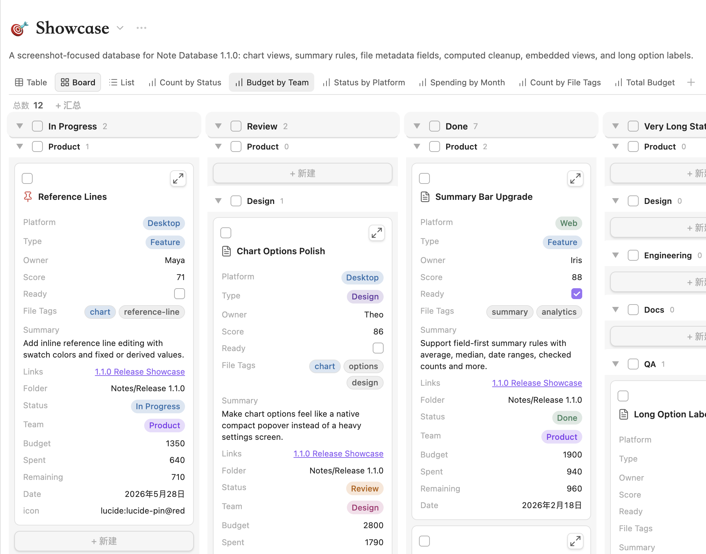

- **类型化批量编辑**：在表格、看板、画廊、列表中一次性编辑多条记录的同一字段，复用原生字段编辑器，并提供影响预览、风险确认、失败回滚和单步撤销。

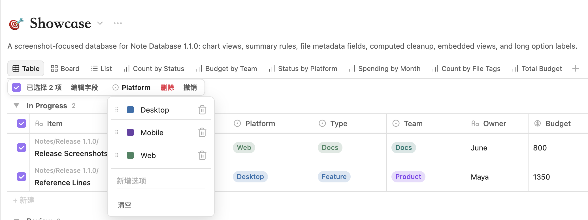

- **来源规则驱动的新建记录**：新笔记会根据当前数据库和视图来源规则反推可写的文件名、文件夹、标签、属性和支持的边界条件；无法保证满足的规则会明确警告。

- **在上方/下方插入记录**：行右键菜单新增「在上方插入」「在下方插入」，保留当前可见分组、子分组和可用的手动排序上下文。

- **面板与编辑打磨**：设置变更后 dashboard 立即刷新；自动列宽按 Markdown、链接、行内代码和 MathJax 实际渲染测量；并改进 `file.*` 字段、标题编辑、Cmd/Ctrl+F 搜索聚焦、移动端数据库列表，以及分组插入和弹窗交互的稳定性。


## 多视图展示

| 表格 | 看板 |
| --- | --- |
|  |  |
| 适合密集属性编辑、列排序、分组、批量选择、列宽调整和结构化检查。 | 适合按状态推进的任务流，支持分组列、子组、卡片字段、手动排序和拖拽更新。 |

| 画廊 | 列表 |
| --- | --- |
|  |  |
| 适合阅读计划、图片资料、作品集和卡片式内容库等视觉浏览场景。 | 适合任务、目录、研究笔记和需要快速浏览的长列表。 |

| 图表 | 时间线 |
| --- | --- |
| 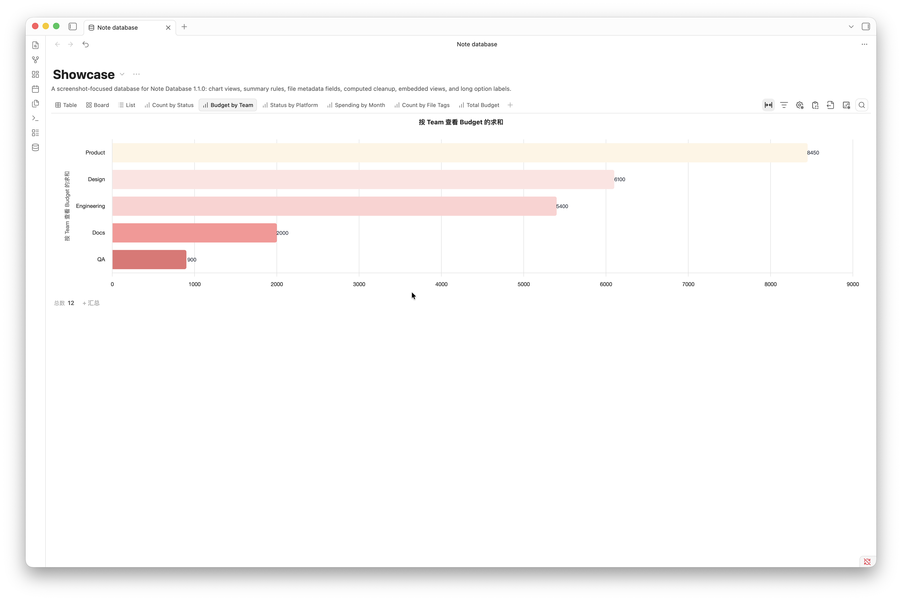 | 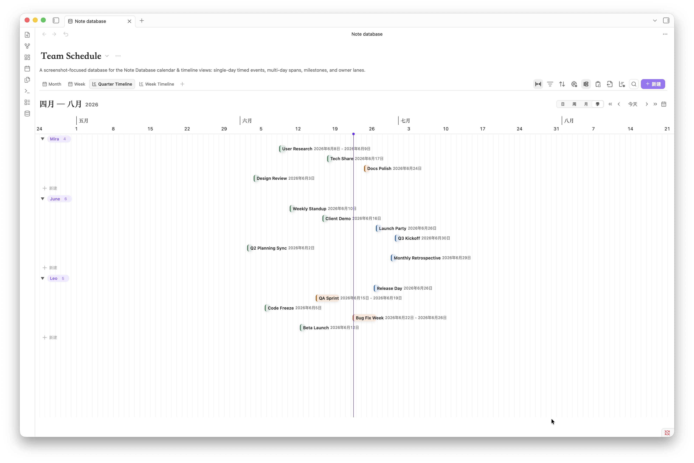 |
| 将当前搜索与筛选结果聚合成可配置图表，支持汇总、明细钻取、色板和导出。 | 适合短期精读和长期压缩概览，支持日、周、月、季尺度、分组、拖拽和 resize。 |

| 日历(月) | 日历(周) |
| --- | --- |
| 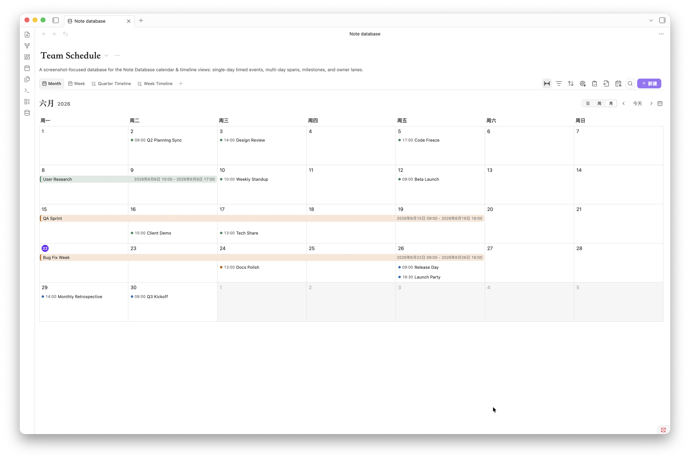 | 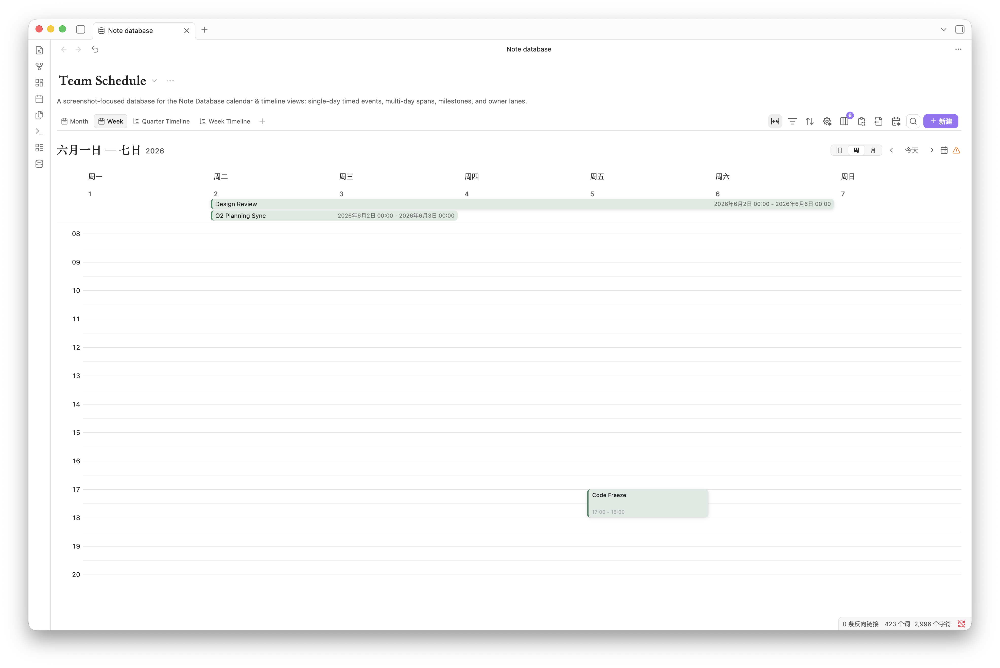 |
| 适合按月查看安排、跨日全天事件和多日计划，并支持直接拖拽或调整起止日期。 | 适合近程排期和具体时段安排，全天区与时间网格可以同时呈现 date 和 datetime 事件。 |

每个视图都可以保存自己的筛选、排序、分组、显示字段、标题字段和布局设置。

## 文本属性与 inline Markdown

任意文本属性都可以在列菜单中选择渲染方式：

- **纯文本（plain）**：按原值显示（默认）。
- **链接（link）**：把 URL 和路径变成可点击链接。
- **Markdown**：渲染 inline markdown。

Markdown 模式支持加粗、斜体、删除线、高亮、行内代码、标准链接 `[显示](目标)`、`[[双链]]`、换行和 LaTeX 公式 `$...$`。解析是递归的，因此标记可以嵌套（比如加粗里包含斜体）。像 `5 * 3` 或孤立的 `**` 这类不成对标记会原样保留，普通文本不会被误伤。

编辑 markdown 单元格时，会浮出一个小工具栏，无需手敲标记就能切换加粗、斜体、删除线、高亮、代码和链接。


| 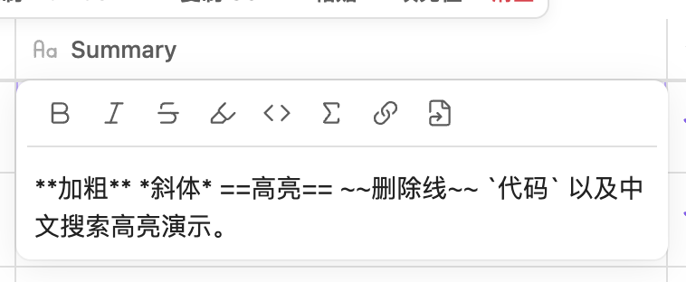 | 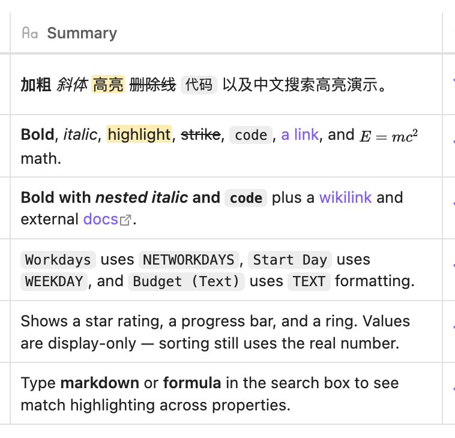 |
| --- | --- |


渲染只由文本节点构建，插件绝不注入原始 HTML，危险链接协议（`javascript:`、`data:`、`file:` 等）一律拒绝。原始 markdown 源码保持不变，排序、搜索和编辑都基于真实值。

## 数字显示样式

数字字段可以用多种方式呈现，且不改变存储的原值：

- **评分（rating）**：星标或自定义 emoji 刻度，适合优先级、难度或评分。
- **进度条（progress bar）**：水平填充条，可自定义等于 100% 的值。
- **圆环（progress ring）**：环形填充，适合紧凑的看板。

这些样式仅用于显示，frontmatter 里的原始数字不会被改写，排序、公式和导出都基于真实值。


| 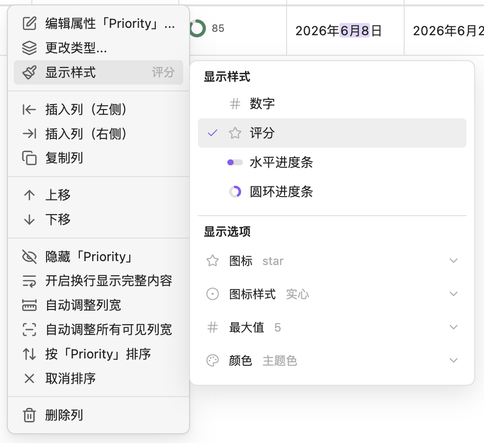 | 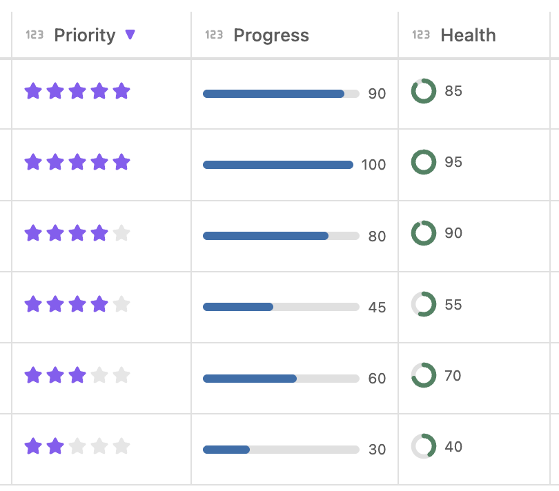 |
| --- | --- |


## 图表视图

图表视图使用当前数据库在搜索、筛选和结果数量限制之后的记录。它支持计数和数值聚合、日期和数字分桶、可见分组、累计序列、参考线、数据标签、图例和 PNG 导出。

点击图表中的柱子、点或扇区，可以先查看匹配记录，再决定是否应用为筛选条件。

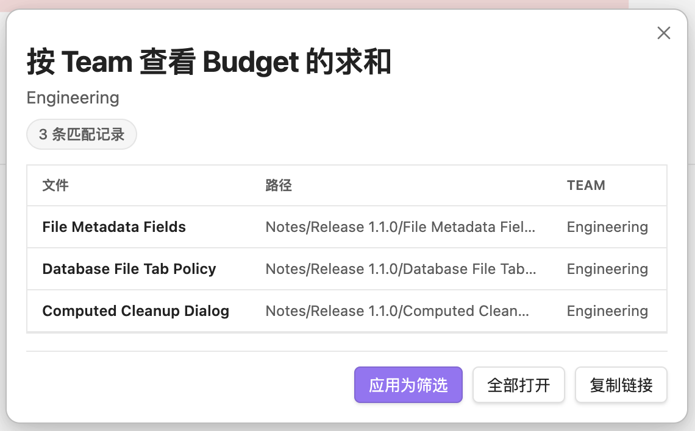

汇总栏现在可以组合计数、数值、日期、复选框和唯一值等多种统计方式。


## 日历和时间线视图

日历视图可以把 date 和 datetime 字段变成月、周、日三种日程视图。跨日事件会在格子中连续显示，全天事件可以拖拽移动或调整起止日期，周/日时间网格可以创建和编辑具体时段事件。datetime 字段也可以选择"忽略时刻"按日期分组，让同一天不同时刻的事件归到同一组。

时间线视图更适合跨多天和长期范围的计划。日尺度用于 datetime 细节，周尺度用于近程精读，月尺度用于多日概览，季尺度用于长期压缩概览。事件可以分组、拖拽、调整范围，并用紧凑的范围标签查看起止时间。

## 快速开始

点击左侧 ribbon 的数据库图标，或在命令面板中运行 `Note database: 打开面板`。你也可以通过命令面板导入数据、转换 `.base` 文件，或打开对应数据库文件。


创建数据库后，选择来源文件夹，再添加属性和视图。来源文件夹决定哪些 Markdown 笔记会被纳入数据库；视图设置决定这组笔记以什么方式呈现。

完整数据库界面的设置面板会区分“当前数据库”和“当前视图”：数据库设置负责名称、描述、来源文件夹和新建目录；视图设置负责标题字段、默认字段宽度、画廊封面、看板子组、状态预设等布局行为。


插件设置页用于配置全局选项，例如语言、默认数据库文件夹、全局状态预设、数据库文件、导入导出和插件回收站。


数据库文件的打开方式也可以在插件设置中调整：你可以让数据库文件总是在新标签页打开，也可以防止同一个数据库文件被重复打开，或按自己的 Obsidian 分栏习惯组合使用。这个策略会同时作用于 Dashboard 打开、文件管理器打开，以及拖拽/打开数据库文件的 fallback 路径。

## 嵌入视图

在完整数据库中右键视图标签，或从导出菜单复制当前视图的嵌入代码。


把代码粘贴到任意 Obsidian 笔记中，就可以得到一个只读的嵌入数据库视图。嵌入视图仍然保留视图切换、筛选、排序、分组、属性显示、计算字段和复制导出等工具栏能力。


如果希望嵌入块省略数据库表头，并把区域尽量留给视图内容，可以使用嵌入块顶部的浮动切换按钮，或手动添加 `hideHeader: true`。

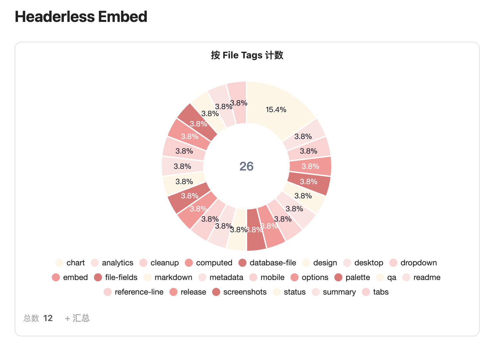

嵌入代码示例：

~~~markdown
```note-database
dbPath: database/Example.md
viewId: mh2g9dz3_abcd123
```
~~~

所有数据库配置现在都会保存为带有 `db_view: true` 的 Markdown 文件，并把配置存储在 frontmatter 的 `database` 对象中。旧版本中保存在插件设置里的数据库会自动迁移。


## 计算字段 / 公式

计算字段支持 `[字段名]` 这样的方括号引用。直接变量名和 `field("field_key")` 也会作为兼容形式保留，但推荐优先使用方括号写法。公式使用安全表达式求值，并提供一组适合笔记数据库的内置函数。

常用函数示例：

| 函数 | 说明 |
| --- | --- |
| `TODAY()` | 当前日期 |
| `NOW()` | 当前日期和时间 |
| `DAYS(start_date, end_date)` | 计算两个日期之间的天数 |
| `DAYSFROMNOW(date)` | 计算某日期距离今天的天数 |
| `ADDDAYS(date, days)` | 给日期增加指定天数 |
| `DATEADD(date, amount, "days")` | 按天、周、月或年增加日期 |
| `NETWORKDAYS(start, end, [holidays])` | 两个日期之间的工作日数，跳过周末和可选节假日 |
| `WEEKDAY(date, [return_type])` | 一周中的第几天；默认 0=周日..6=周六，可选 Excel return type |
| `ROUND(number, digits)` | 四舍五入 |
| `FLOOR(number)`, `CEILING(number)` | 数学取整函数 |
| `MAX(a, b, ...)`, `MIN(a, b, ...)` | 比较大小 |
| `TEXT(value, format)` | 格式化数字（如 `#,##0.00`、`0%`）或日期 |
| `CONCAT(text1, text2, ...)` | 拼接文本 |
| `IF(condition, trueValue, falseValue)` | 条件判断 |

公式编辑器会显示可用字段（每个带类型图标）、函数列表、示例、实时预览、引用字段值和逐步替换过程，避免用户在一个大文本框里盲写公式。右上角还提供复制 AI 提示词的入口，方便把当前字段、函数和公式草稿发给任意 AI 辅助修改。

打开数据库视图时，计算值始终会刷新用于展示。你可以在数据库设置中选择仅展示的虚拟属性、不写回 frontmatter；自动写回；或者只在点击手动同步按钮后写回。


如果你曾经把计算结果保存进笔记 frontmatter，后来又决定只在数据库中显示，可以使用清理入口，从当前数据库范围内的笔记中删除已保存的计算属性。

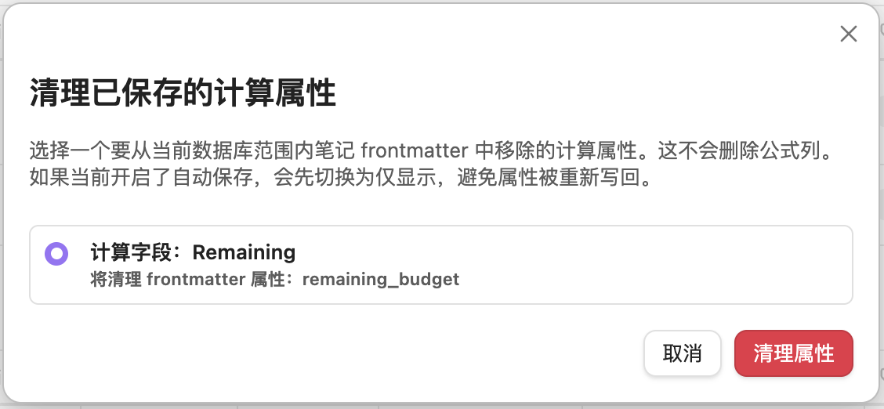

## 搜索与来源规则

**搜索** 会匹配所有可见属性值以及文件名中的文字，并在结果里高亮命中处。搜索是临时的会话级筛选 —— 不会写入数据库或笔记文件，因此切换分栏不会留下陈旧的查询。日期属性会匹配可见的本地化显示文本或显式日期格式（`YYYY-MM-DD`、`YYYY-MM`、`MM-DD`）。

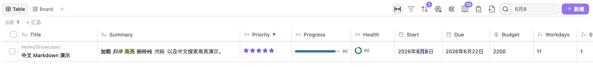

**来源规则** 决定哪些笔记属于数据库。可以用文件夹、标签、属性、链接和表达式规则，配合 `AND` / `OR` / `NOT` 逻辑组合。每个视图都可以在数据库级规则之上单独启用/禁用自己的来源规则，这样一个数据库就能驱动多个不同范围的视图。自定义属性选择器可搜索且带类型图标，Obsidian 内置的 `aliases` 等 list 属性会按多值字段处理。

如果你已经在用 Obsidian Bases，来源规则、`aliases` 和 `.base` 转换会与普通筛选、分组、排序对多值字段的处理保持一致。

## 文件元数据字段

`file.name`、`file.tags`、`file.links`、`file.folder` 和文件时间等内置字段会被视为文件元数据，而不是普通 frontmatter 属性。`file.name` 可以重命名笔记，`file.tags` 可以更新 frontmatter tags，只读文件元数据会被保护，避免误写入。

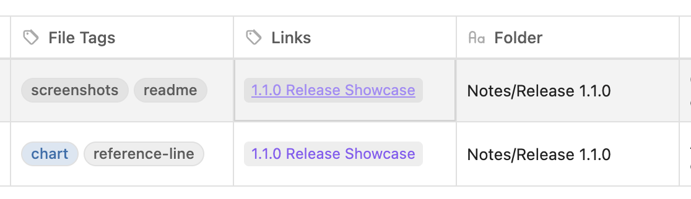

## 导入导出与 .base 转换

Note Database 支持把当前数据库导出为 CSV + Markdown ZIP，也支持再导入这种格式。导出时可以选择 ZIP 保存位置，也可以选择是否把 frontmatter 字段写入 Markdown 文件，ZIP 内还会包含数据库元数据，方便在重新导入时尽量恢复属性、视图和配置结构。

如果导入的 CSV + Markdown 文件没有包含数据库元数据，插件会根据 CSV 内容推断字段类型，并在导入前弹出确认界面，让你检查日期、数字、复选框、单选、多选、状态等字段类型。

工具栏的导出菜单还可以把当前视图复制为嵌入代码、CSV 或 Markdown 表格。


如果你已经使用了 Obsidian Bases，可以通过命令面板把当前 `.base` 文件转换为 Note Database 数据库。转换会尽量保留来源规则、列顺序、列宽、排序、分组，以及 cards/list 视图信息。

来源筛选会保留嵌套的 `AND`、`OR` 和 `NOT` 结构，不会被压平成近似规则。简单规则会以字段和操作符形式编辑；更完整的 Bases 筛选语句会保留为可编辑的表达式规则，并通过内置兼容层执行。插件扩展等无法支持的表达式不会被静默简化。

转换后会弹出属性确认界面，你可以在导入前检查字段类型，把日期、数字、复选框、单选、多选、状态等字段调整到合适类型。

## 安装

### 从 Obsidian 社区插件市场安装

1. 打开 Settings -> Community Plugins。
2. 搜索 `Note Database`。
3. 安装并启用插件。

### 手动安装

1. 从最新 release 下载 `main.js`、`styles.css` 和 `manifest.json`。
2. 在 vault 中创建 `.obsidian/plugins/note-database/` 文件夹。
3. 把三个文件复制进去。
4. 在 Settings -> Community Plugins 中启用插件。

## 隐私

Note Database 完全在 Obsidian 本地运行。它不会把 vault 内容、metadata、公式或设置发送到任何外部服务。详情见 [PRIVACY.md](PRIVACY.md)。

## 支持与打赏

如果 Note Database 帮到了你，欢迎 star 或通过下面的链接支持后续开发：

<a href="https://paypal.me/pangy9">
  
</a>


## 更新记录

### 1.2.5

- 新增来源规则驱动的新建记录：新笔记会根据当前数据库和视图来源规则反推可写的文件名、文件夹、标签、属性和支持的边界条件；无法保证满足的规则会明确警告。
- 新增跨表格、看板、画廊和列表的类型化批量编辑，复用原生字段编辑器，并统一提供影响预览、风险确认、选项登记、失败回滚和单步撤销。
- 通过插件 UI 明确输入或采用的单选、状态和多选新值会自动登记；外部编辑写入的值仍不会自动污染数据库 schema。
- 新增可配置的数据库图标和记录图标，支持 Unicode Emoji 与 Lucide 图标。看板、画廊、列表、日历和时间线可继承数据库图标字段，也可按视图覆盖。
- 行右键菜单新增“在上方插入”和“在下方插入”，会保留当前可见分组、子分组和可用的手动排序上下文。

- 插件设置变更后，已打开的 dashboard 会立即刷新；数据库重排或删除后会按数据库身份恢复当前选择。
- 自动列宽现在会按 Markdown、链接、粗体、行内代码和 MathJax 公式的实际渲染结果测量，并改进画廊分组宽度联动和新增列定位。
- 改进 `file.*` 字段、标题编辑、Cmd/Ctrl+F 搜索聚焦、移动端数据库列表，以及分组插入和弹窗交互的多个边缘问题。

### 1.2.4

- 修复表格选择列 checkbox 对齐。

### 1.2.3

- 新增全局属性类型冲突检测：当多个数据库文件把同一个 frontmatter 属性定义成不兼容的底层存储形态时，会弹出可直接修复的冲突处理窗口。
- 新增日历和时间线事件的浮动记录详情面板，支持编辑字段、重命名文件名、文本链接/Markdown 渲染和图片缩略图。
- 改进日历和时间线搜索：搜索框聚焦时显示结果浮层，展示总命中数、当前范围命中数、分组结果、点击跳转和跳转高亮反馈。
- 优化日历和时间线的事件布局、拖拽、resize、mini-calendar 标记、无效事件过滤和月视图行密度，跨日事件表现更一致。
- 新增表格键盘导航、选项弹窗焦点保护、记录复制/克隆，并修复 CSV/Markdown 剪贴板粘贴时逗号内容被截断的问题。
- 统一看板、画廊、列表、日历、时间线的标题字段行为：标题字段已配置但为空时显示明确的空标题，不再静默退回文件名。
- 新增列管理器中的文件属性快捷入口、删除列时可选择是否清理笔记 frontmatter、日期/时间小日历编辑，以及列表卡片字段的紧凑换行布局。

### 1.2.2

- 文本属性新增 inline Markdown 渲染（加粗、斜体、高亮、删除线、代码、链接、双链、LaTeX），支持按列切换纯文本/链接/Markdown 渲染模式，编辑时带浮动格式工具栏。
- 数字字段新增显示样式：评分（星标或 emoji）、进度条、圆环 —— 仅用于显示，绝不改写存储值。
- 公式扩展 `NETWORKDAYS`、`WEEKDAY`（可选 return type）、`TEXT`，公式编辑器属性联想补字段类型图标。
- 搜索增强：匹配所有属性值加文件名、结果高亮命中文字，搜索改为临时态，切换分栏不丢不留旧查询。
- 来源规则统一：legacy typeFilter 迁移到来源规则、按视图启用/禁用开关、可搜索的类型图标属性选择器，`aliases` / Bases 多值语义全面对齐。
- 新增 checkbox 范围（shift 点击）选择（表格与选项弹窗）、文本编辑器 IME 合成期 Enter/Esc 保护、分组记录数限制。
- 改进移动端布局，包括专门的列宽调整面板和更合理的卡片字段宽度。

### 1.2.1

- 新增手机端表格列宽调整面板，优化移动端设置与表格选择列。
- 新增分组记录数限制与看板卡片字段宽度控制（board/gallery 限宽、list 生效）。
- 新增数字评分/进度条/圆环显示样式，修复看板长组标题顶住列宽的问题。
- 改进 datetime 编辑（时刻分段输入）与 datetime "忽略时刻" 分组。
- 完善嵌入引用处理与无效事件的只读 warning。

### 1.2.0

- 新增日历和时间线视图，支持基于 date / datetime 属性的月、周、日、日尺度时间线、周/月/季时间线。
- 改进日期和日期时间处理，包括本地化显示、datetime 公式、跨日标签、无效区间检测和修复提示。
- 打磨日历和时间线交互，包括拖拽、resize、当前范围高亮、迷你日历跳转、裁切事件 fade 和响应式时间线窗口。
- 修复日历和时间线按天拖拽 datetime 事件时丢失具体时刻的问题。
- 改进看板视图中，卡片、分组、行和时间线事件的拖拽反馈。
- 改进嵌入视图刷新行为，避免数据库嵌入块刷新时把正在编辑的 Markdown 笔记滚回嵌入区域。

### 1.1.0

- 新增图表视图，支持柱状、水平柱状、折线、面积、环形、数字、堆叠、分组、百分比堆叠和混合图。
- 新增图表设置、图表汇总、可见分组、色板、参考线、明细钻取，以及 PNG 导出/复制。
- 汇总栏扩展为总和、数值、日期、复选框、唯一值、空值和已填写等多种统计方式。
- 新增受保护的文件元数据字段，包括可编辑的 `file.name`、`file.tags`、可点击文件链接和只读元数据防护。
- 新增计算字段 frontmatter 清理入口，方便移除曾经写入笔记属性区的计算结果。
- 新增数据库文件 tab 控制，可以设置总是在新标签页打开数据库文件，以及避免重复打开同一个数据库文件。
- 改进嵌入视图、共享下拉菜单、来源规则、拖拽反馈、选项编辑和发布前 UI 细节。


完整历史见 [GitHub Releases](https://github.com/pangy9/obsidian-note-database/releases)。
